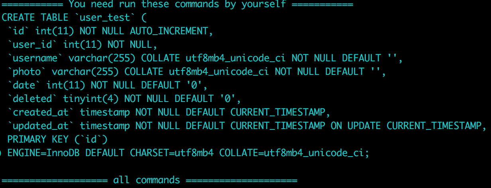

## 使用DBDiff以及simple-db-migrate实现简单的数据库版本控制
该项目是fork的,关于原项目的介绍和使用请参考[DBDiff](https://dbdiff.github.io/DBDiff/)。

### 做了什么

1. 使用docker将DBDiff和simple-db-migrate的运行环境搭建好，使用docker run即可运行程序（搭建环境还是比较麻烦的一件事）

### 为了什么
1. 使用DBDiff极大的减少了自己维护migrate文件，并且能确保一份完整的base的数据库。并且结合
simple-db-migrate将DBDiff生成的migrate文件执行，最终实现自动化。

2. 对于开发者而言，他们只需要直接修改base数据库的相关字段，文件提交后，由DBDiff去生成migrate，省去开发而外编写相关代码。开发需要与主数据库保持一致性时，只需要运行相关docker，程序自动将diff提交到本地

3. 最终希望实现开发，CI／CD，运维的自动化

### 如何使用
#### DBDiff
1. 直接使用我构建好的docker镜像，然后运行
`docker run -it -rm -v /tmp/migrate:/DBDiff/migratesql wjj5699121/dbdiff:1.0 ./dbdiff --server1=user:password@host1:port --server2=user:password@host1:port server1.test:server2.test`
详细的参数可参考[DBDiff](https://dbdiff.github.io/DBDiff/)，这里需要说明的一点是`server2.test:server1.test`冒号后面的是需要同步的DB，前面的是你拿来比较的DB，不要弄反了。运行后会在终端显示出你需要执行的sql语句，或者挂载/DBDiff/migratesql目录会生成一个sql文件，如下图：

2. git clone 该项目然后自己build镜像，这样mysql的账号密码相对安全，也不用附带其它参数，对于不同的开发者，运行docker只需要添加本地的mysql参数
`./dbdiff --server1=user:password@host1:port server2.test:server1.test`

#### dbdiff-migrate
1. 将dbdiff和simple-db-migrate结合起来,对于开发者，只需要统一做一个镜像（dockerfile在dockerfile文件夹中），修改.dbdiff文件，将dev或prod的数据信息写入server2中。每个开发者修改修改下面命令行中 -e 的参数，即自己本机的数据库信息。
`docker run -it --rm -e DATABASE_HOST=192.168.1.6 -e DATABASE_USER=root -e DATABASE_PASSWORD=1111 -e DATABASE_PORT=33060  wjj5699121/dbdiff-migrate:1.0`
2. 使用该镜像就不用自己再去运行生成的sql语句，实现自动化。